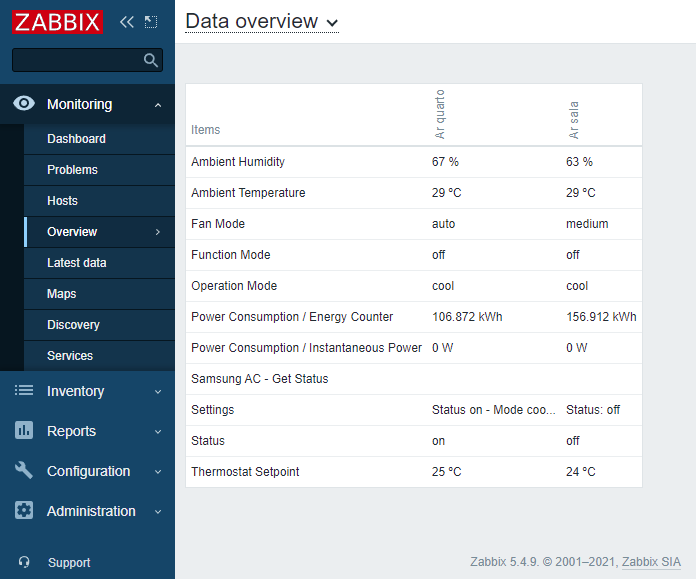
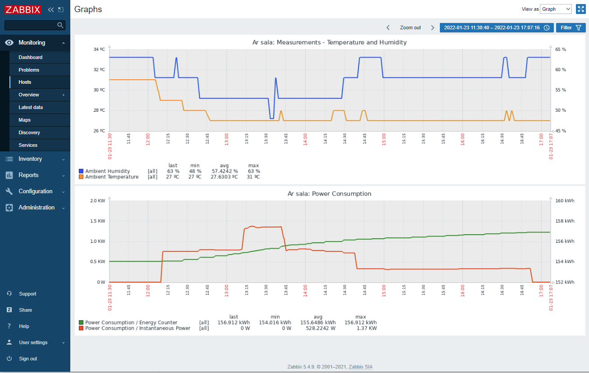

# Templates for SmartThings API - Samsung AC

This template can discovery the Samsung Air Conditioner already registered in your SmartThings account.

## Intructions

## 1. Import the XML template to your Zabbix Server
Go to your Zabbix Server, on the Configuration/Templates page.
At the top right of the page, click IMPORT an select the XML template you got from this repo.

## 2. Obtain an PAT (Personal Access Token)
Go to https://account.smartthings.com/tokens and register or login. If you already have SmartThings App on your phone, use that credentials.

Create a new token, name it for example "Zabbix".

You'll need to select authorization at least for:
- List all Devices   (Listar todos os dispositivos)
- Devices details    (Ver todos os dispositivos)

## 3. Add the discovery template to a host
You can create an empty host for that, or just use the already existing "Zabbix server" built in host.

Go to **Configurations/Hosts**, select **Zabbix server**.

Go to the **templates tab**, and at **link new templates** search and select the Discovery template: **SmartThings - Samsung AC Discovery**

Don't forget to save, click on **update**

## 4. Add the Macro Token to the host
Access the host **Zabbix server** again, and go to **Macro tab**

Add a new macro, named exactly `${STTOKEN}` and paste your token in the value field.

## 5. Execute the Discovery
Access again Configuration/Hosts, then **Zabbix Server**. 

Click in the **Discovery rules** at the top of screen.

Check **SmartThings - Samsung AC Discovery: AC Discovery**, and click the button **Execute now**

Wait a few seconds, and go to the page **Monitoring/Hosts**, to see if the discovery found any Air Conditioner!

### Screenshots

Example of readings from **Monitoring/Overview/Data overview** page:

# Important Notes
I don't know about restrictions from the Samsung/SmartThings platform from periodically reading. The information of each ar-conditioner is collected in intervals of 10 minute. And the discovery runs in 3 hour interval.

Humidity: The SmartThings application don't display humidity, but using the API I can see it is available, but I don't know if it is accurate.
